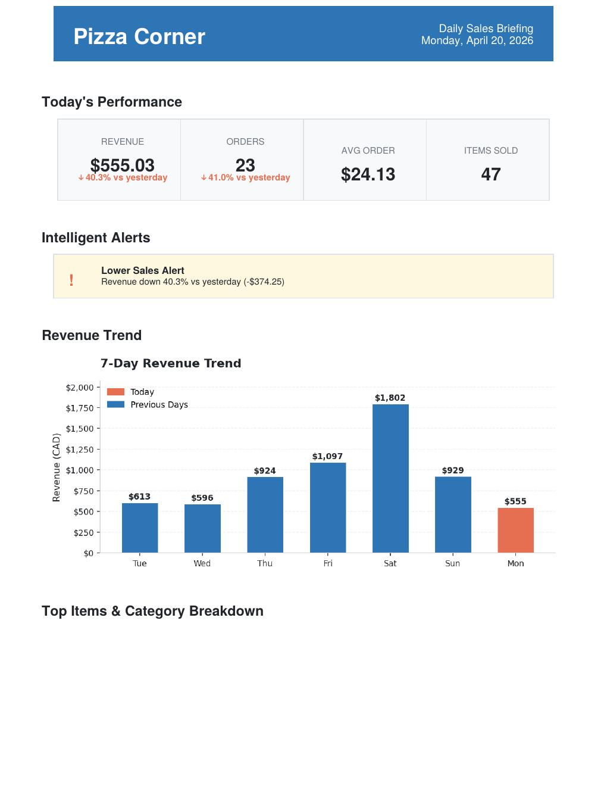

# Daily Sales Briefing (Demo)

A lightweight Python-based tool that transforms raw sales data into a clear, structured daily report.

This repository contains a **limited demo version** designed to showcase the core functionality and architecture of the system.

---

## 📌 Overview

Small businesses generate sales data every day, but often lack the time or tools to analyze it effectively.

**Daily Sales Briefing** solves this by automatically:

- Processing raw sales data  
- Calculating key performance metrics  
- Generating visual insights  
- Producing a clean, ready-to-use PDF report  

The goal is simple:

> Turn raw data into clear, actionable insights — in seconds.

---

## 📊 Example Output

The system generates a structured report including:

- Daily revenue, orders, and average order value  
- Comparison with previous performance  
- Top-selling products  
- Category-level breakdown  
- Visual charts (trend + distribution)  

**Sample Report Preview:**



📄 [Download the full sample report (PDF)](sample_report.pdf)

---

## 🚀 Features (Demo Version)

- CSV-based data input  
- Basic data validation  
- Core KPI calculations  
- 7-day revenue trend visualization  
- Top items analysis  
- Category breakdown  
- PDF report generation  
- Modular project structure  

---

## ⚠️ Demo Limitations

This repository contains a **simplified version** of the full system.

The demo version:

- Uses a single data source (CSV only)  
- Includes simplified alert logic  
- Does not support multi-platform integrations  
- Does not include full configuration flexibility  
- Email automation is limited or disabled  

The full version includes more advanced capabilities and is not publicly available.

---

## 🧠 Technical Highlights

This project demonstrates:

- Data processing with Python (pandas)  
- Modular architecture (adapters, analysis engine, reporting layer)  
- Handling real-world data challenges (missing values, edge cases)  
- Chart generation using matplotlib  
- Automated PDF report generation  
- Config-driven design  
- Logging and error handling  

---

## 🏗 Project Structure

```
project/
│
├── data/               # Sample input data
├── reports/            # Generated reports
├── src/
│   ├── adapters.py     # Data input layer
│   ├── analyzer.py     # Core analytics logic
│   ├── charts.py       # Visualization
│   ├── pdf_generator.py
│   ├── logger.py
│   └── main.py         # Entry point
│
├── config.ini
└── README.md
```

---

## ⚙️ How to Run

1. Clone the repository:
```
git clone https://github.com/Ali-Razeghi/daily-sales-briefing.git
cd daily-sales-briefing
```

2. Install dependencies:
```
pip install -r requirements.txt
```

3. Run the program:
```
python src/main.py
```

4. Check the output:
```
reports/
```

---

## 📈 Use Cases

This tool is designed for:

- Small retail businesses  
- Restaurants and cafés  
- Local shops  
- Business owners who want quick daily insights  

---

## 🔒 License & Usage

This project is provided for **portfolio and demonstration purposes only**.

- Commercial use is not allowed  
- Redistribution or modification without permission is prohibited  

For access to the full version or collaboration opportunities, please contact me.

---

## 👤 Author

Ali Razeghi  
Data Analysis | Python | Business Intelligence  

🔗 LinkedIn: [linkedin.com/in/razeghi-ali](https://www.linkedin.com/in/razeghi-ali/)  
🔗 GitHub: [github.com/Ali-Razeghi](https://github.com/Ali-Razeghi)

---

## 📬 Contact

I'm currently open to:

- Entry-level roles in Data Analysis / BI  
- Freelance work for small business reporting solutions  

Feel free to reach out.
